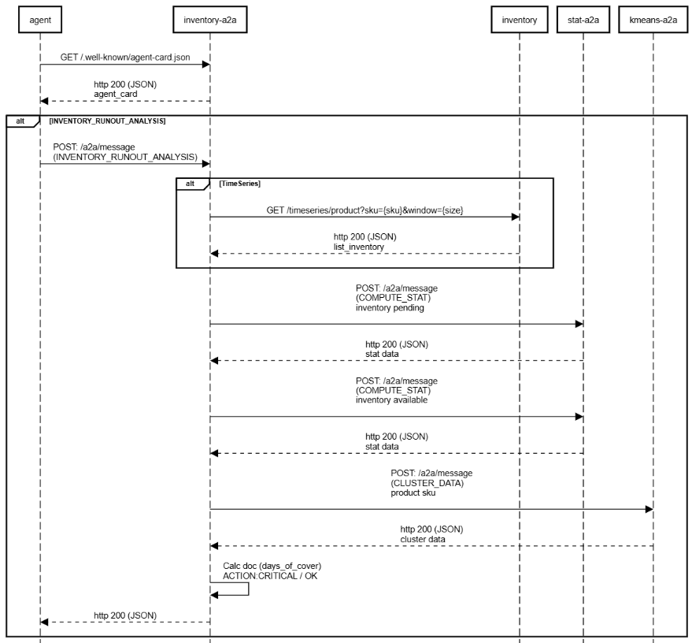
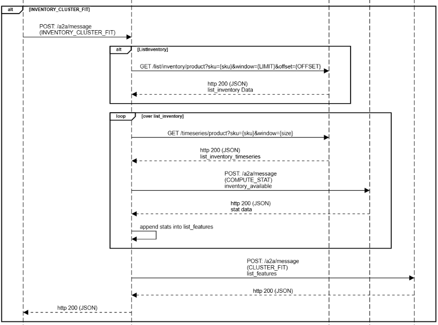
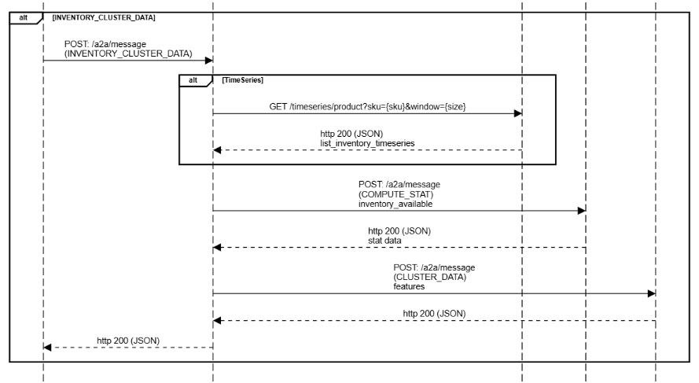

## py-inventory-a2a

py-inventory-a2a is a a2a agent to analyze the inventory subjects.

days_of_cover_ratio:

$$S = \min\left(1, \frac{C}{L \times k}\right)$$

$C$: days_of_cover.

$L$: lead_time.

$k$: A "Buffer Multiplier." (e.g., $k=2$ means you consider yourself "Full" if you have twice the lead time covered).

slope_ratio:

$$V = \min\left(1, \frac{|m|}{m_{max}}\right)$$

$|m|$: The absolute value of your inventory_available_slope.

$m_{max}$: Your "Target Speed." This is the depletion rate you consider to be "100% capacity" or "Full Speed" for your operations.

## diagram

    inventory a2a

    participant agent
    participant inventory-a2a
    participant inventory
    participant stat-a2a
    participant kmeans-a2a

    agent->inventory-a2a:GET /.well-known/agent-card.json
    agent<--inventory-a2a:http 200 (JSON)\nagent_card

    alt INVENTORY_RUNOUT_ANALYSIS
      agent->inventory-a2a:POST: /a2a/message\n(INVENTORY_RUNOUT_ANALYSIS)

      alt TimeSeries
        inventory-a2a->inventory:GET /timeseries/product?sku={sku}&window={size}
        inventory-a2a<--inventory:http 200 (JSON)\nlist_inventory
      end

      inventory-a2a->stat-a2a:POST: /a2a/message\n(COMPUTE_STAT)\ninventory pending\n
      inventory-a2a<-- stat-a2a:http 200 (JSON)\nstat data
      inventory-a2a->stat-a2a:POST: /a2a/message\n(COMPUTE_STAT)\ninventory available\n
      inventory-a2a<--stat-a2a:http 200 (JSON)\nstat data
      inventory-a2a->kmeans-a2a:POST: /a2a/message\n(CLUSTER_DATA)\nproduct sku\n
      inventory-a2a<-- kmeans-a2a:http 200 (JSON)\ncluster data
      inventory-a2a->inventory-a2a:Calc doc (days_of_cover)\nACTION:CRITICAL / OK
      agent<--inventory-a2a:http 200 (JSON)
    end

    alt INVENTORY_CLUSTER_FIT
      agent->inventory-a2a:POST: /a2a/message\n(INVENTORY_CLUSTER_FIT)
      alt ListInventory
          inventory-a2a->inventory:GET /list/inventory/product?sku={sku}&window={LIMIT}&offset={OFFSET}
          inventory-a2a<--inventory:http 200 (JSON)\nlist_inventory Data
      end
      loop over list_inventory
        inventory-a2a->inventory:GET /timeseries/product?sku={sku}&window={size}
        inventory-a2a<--inventory:http 200 (JSON)\nlist_inventory_timeseries
        inventory-a2a->stat-a2a:POST: /a2a/message\n(COMPUTE_STAT)\ninventory_available
        inventory-a2a<-- stat-a2a:http 200 (JSON)\nstat data
        inventory-a2a->inventory-a2a:append stats into list_features
      end

      inventory-a2a->kmeans-a2a:POST: /a2a/message\n(CLUSTER_FIT)\nlist_features
      inventory-a2a<--kmeans-a2a:http 200 (JSON)
      agent<--inventory-a2a:http 200 (JSON)

    end

    alt INVENTORY_CLUSTER_DATA
      agent->inventory-a2a:POST: /a2a/message\n(INVENTORY_CLUSTER_DATA)
      alt TimeSeries
        inventory-a2a->inventory:GET /timeseries/product?sku={sku}&window={size}
        inventory-a2a<--inventory:http 200 (JSON)\nlist_inventory_timeseries
      end
        inventory-a2a->stat-a2a:POST: /a2a/message\n(COMPUTE_STAT)\ninventory_available
        inventory-a2a<-- stat-a2a:http 200 (JSON)\nstat data
      inventory-a2a->kmeans-a2a:POST: /a2a/message\n(CLUSTER_DATA)\nfeatures
      inventory-a2a<--kmeans-a2a:http 200 (JSON)
      agent<--inventory-a2a:http 200 (JSON)
    end

### Endpoint

    curl --location 'http://localhost:8000/a2a/message' \
    --header 'Content-Type: application/json' \
    --data '{
        "source_agent": "user-postman",
        "target_agent": "inventory-agent",
        "message_type": "INVENTORY_RUNOUT_ANALYSIS",
        "payload": {
            "product": {
                "sku": "cheese-fr-20"
            },
            "period" :{
                "step_behind": 7,
                "duration": 14
            }
        }
    }'

    curl --location 'http://localhost:8000/a2a/message' \
    --header 'Content-Type: application/json' \
    --data '{
        "source_agent": "user-postman",
        "target_agent": "inventory-agent",
        "message_type": "INVENTORY_CLUSTER_FIT",
        "payload": {
            "product": 
                {
                "sku": "cheese-fr"
                }
        }
    }'

    curl --location 'http://localhost:8000/a2a/message' \
    --header 'Content-Type: application/json' \
    --data '{
        "source_agent": "user-postman",
        "target_agent": "inventory-agent",
        "message_type": "INVENTORY_CLUSTER_DATA",
        "payload": {
            "product":
                {
                "sku": "cheese-fr-1"
                }
        }
    }'